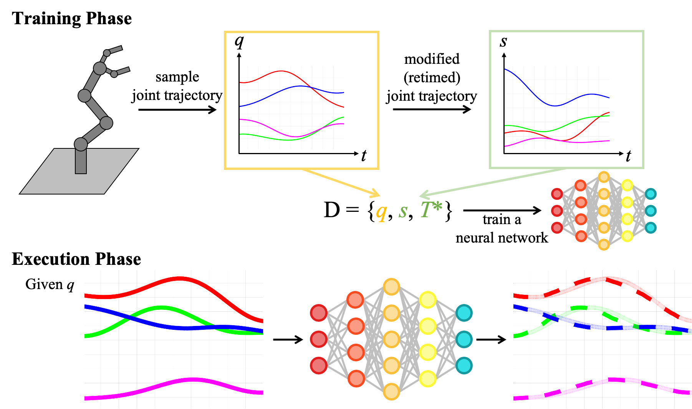

# Motion Stabilizer

Upon acceptance, this repository will contain the code for the accompanying paper *"Learning-based Motion Stabilizer Leveraging Offline Temporal Optimization"*, by Min Sung Ahn, Hosik Chae, Colin Togashi, Dennis Hong, Joohyung Kim, and Sungjoon Choi.

### Abstract

During loco-manipulation, instabilities to the robot's base can be introduced by the manipulator's motions. Especially, trajectories that are generated on-the-fly, such as during teleoperation, may jeopardize the stability and safety of the robot and its surroundings. 
This work proposes a self-supervised learning-based pipeline to keep a robot stable while executing a given trajectory. Empirical results show that the desired objective can be achieved with the proposed pipeline. Experiments are done in simulation and on hardware on a unique multi-modal, manipulation-capable legged robot, and its scalability is tested on a conventional manipulator.